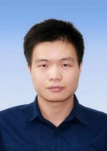
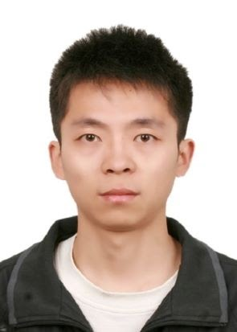
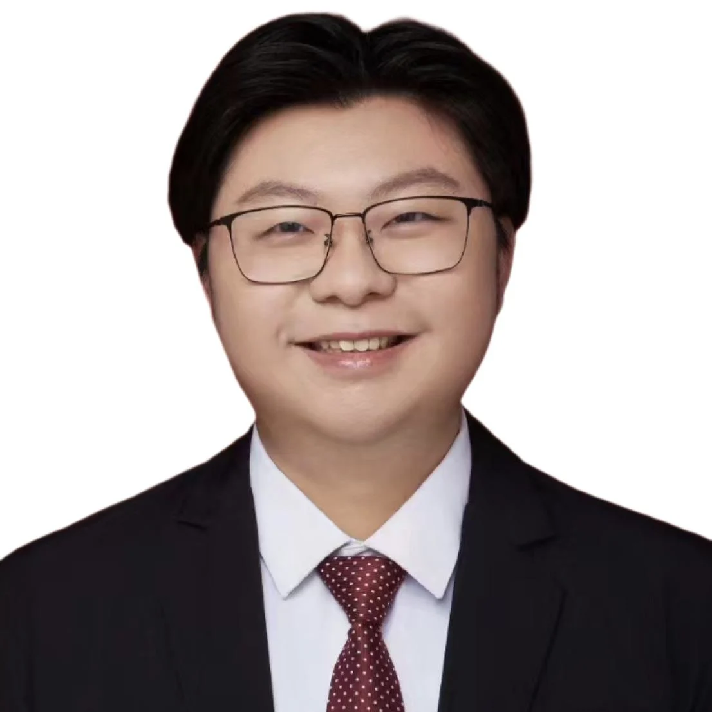
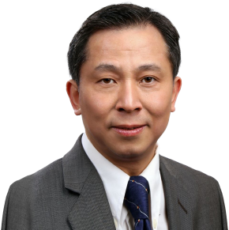

## Tutorial Abstract

Time series analysis stands as a focal point within the data mining community, serving as a cornerstone for extracting valuable insights crucial to a myriad of real-world applications. Recently, the classic frequency analysis methods (e.g., Discrete Fourier Transform, Discrete Wavelet Transform, Discrete Cosine Transform, etc) have been increasingly integrated into machine learning and deep learning, significantly enhancing the accuracy and efficiency of time series analysis.

This tutorial comprehensively surveys the latest advances, challenges, and diverse applications of deep learning-based time series analysis employing frequency transformations and frequency learning methods. We systematically investigate various incorporation approaches, model architectures, representative frequency-enhanced neural networks, and their applications across forecasting, anomaly detection, and classification tasks. Moreover, we discuss the theoretical foundations, highlight the strengths and limitations of frequency domain methods, and outline promising future research directions to address real-world challenges and expand practical applications.

## Target Audience
This tutorial targets researchers, students, and practitioners interested in deep learning and time series analysis, and is structured to accommodate different levels of expertise. Introductory participants are expected to be familiar with the basics of time series analysis, deep learning, and frequency domain methods. Intermediate attendees will benefit from technical insights on integrating frequency analysis with neural networks and practical guidance on public code and datasets. Advanced participants can explore practical applications, limitations, and future directions for frequency-domain enhanced deep learning models. While no specific prerequisite knowledge or skills are required, familiarity with signal processing, machine learning, deep learning concepts—particularly neural network architectures—and fundamental time series analysis methods will be helpful.

## Tutorial Materials and Outline

### Our [[survey paper]](https://arxiv.org/abs/2302.02173) 

### Tutorial Outline

### 1. Introduction and Motivation [10 mins] 

  > - Overview of the growing importance of time series analysis
  > - Key Issues and Challenges
  > - Motivation for Frequency Domain Analysis

### 2. Foundations of Frequency Transformation [15 mins]

  > - Review of Discrete Fourier Transform (DFT), Discrete Cosine Transform (DCT), etc
  > - Theoretical Foundations of Frequency-Domain Methods in Time Series Analysis

### 3. Deep Learning Approaches in the Frequency Domain [70 mins]

  > - Feature Engineering Approaches: Seasonal/periodic feature extraction, multi-scale wavelet coefficients
  > - Compression and Noise Filtering: Leveraging low-frequency components to remove high-frequency noise
  > - Fourier Neural Operators: Introduction to neural operator theory and efficient architectures (e.g., PDE-based modeling)

### (Break - 20 min)

### 4. Applications across Time Series Tasks [20 mins]

  > - Time Series Forecasting
  > - Anomaly Detection and Imputation
  > - Time Series Classification

### 5. Advantages and Limitations [15 mins]

  > - Loss of fine-grained temporal detail and phase information
  > - Complexity of multi-resolution feature fusion
  > - Integrating time-frequency transforms for both local and global patterns

### 6. Challenges and Future Directions [20 mins]

  > - Novel Orthogonal Transform Methods (Partial Fourier, Fractional Fourier, orthogonal polynomial expansions)
  > - Joint Learning in Time and Frequency: Hybrid frameworks combining time-domain and frequency-domain encoders
  > - Scaling Up: Handling high-dimensional, large-scale time series using multi-GPU or distributed processing

### Q&A [10 mins]

## Short Bio of Tutors

**[Kun Yi](https://github.com/aikunyi)** is affiliated with the State Information Center and specializes in deep learning with a focus on big data analytics and
frequency-based methods for time series. His current research explores the integration of multimodal large language models (LLMs) into time series analysis to advance macroeconomic governance.
 

**[Qi Zhang](https://sites.google.com/view/qizhang-bit-uts)** is currently a associate professor at Tongji University. His research focuses on time series analysis, frequency-domain neural network, and general AI. Qi Zhang has published 60+ top-rank papers. He has also delivered 4 tutorials on data mining, recommender systems. Additionally, he has experience as a teaching assistant, teaching courses on Machine Learning and the Frontier of Computer Science at Tongji University.
 

**[Wei Fan](https://weifan.site)** is currently working as a Postdoctoral Researcher in the Medical Sciences Division at the University of Oxford, UK. His research focuses on data-centric AI, time series modeling, and spatial-temporal data mining. He is also dedicated to applying these methods to solve real-world data science applications, such as healthcare, transportation, and energy. 
 

**[Qingsong Wen](qingsongedu@gmail.com)** is currently the Head of AI & Chief Scientist at Squirrel Ai Learning. Before that, he worked at Alibaba, Qualcomm, Marvell, etc., and received his M.S. and Ph.D. degrees in Electrical and Computer Engineering from Georgia Institute of Technology,  USA. His research interests include machine learning, data mining, and signal processing, especially AI for Time Series (AI4TS), LLM & AI Agent. Currently, he serves as Co-Chair of Workshop on AI for Time Series (AI4TS @ KDD, ICDM, SDM, AAAI, IJCAI). He also serves as Area Chair of NeurIPS, ICML, KDD, IJCAI, etc.
 

**[Hui Xiong]( https://www.hkust-gz.edu.cn/people/hui-xiong/)** is a Chair Professor at Hong Kong University of Science and Technology (Guangzhou) and Associate Vice President for Knowledge Transfer. He have had the privilege of contributing extensively to the fields of artificial intelligence, machine learning, and data science, and he is recognized as an IEEE Fellow, AAAS Fellow, AAAI Fellow and ACM Distinguished Scientist for his work in advancing knowledge in these domains. Before his time at the Hong Kong University of Science and Technology, he was a distinguished professor at Rutgers, the State University of New Jersey, from 2007 to 2021. His accolades include the AAAI-2021 Best Paper Award, the 2018 Ram Charan Management Practice Award, as the Grand Prix winner from the Harvard Business Review, the 2017 IEEE ICDM Outstanding Service Award, the 2016 RBS Dean’s Research Professorship, the 2009 Rutgers University Board of Trustees Research Fellowship for Scholarly Excellence, the ICDM-2011 Best Research Paper Award.
 

## Related Tutorials
  > - [Qingsong Wen, Yuxuan Liang, Dongjin Song, Shirui Pan, Ming Jin. Foundation Models for Time Series Analysis: A Tutorial and Survey. In AAAI 2025.](https://aaai.org/conference/aaai/aaai-25/tutorial-and-lab-list)
  > - [Qingsong Wen, Yuxuan Liang, Dongjin Song, Shirui Pan. Foundation Models for Time Series Analysis: A Tutorial and Survey. In SIGKDD 2024.](https://wenhaomin.github.io/FM4TS.github.io/)
  > - [Qingsong Wen, Linxiao Yang, Tian Zhou, Liang Sun, Robust Time Series Analysis and Applications: An Industrial Perspective. In SIGKDD 2022.](https://qingsongedu.github.io/timeseries-tutorial-kdd-2022/)

